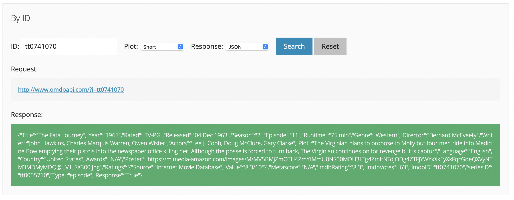
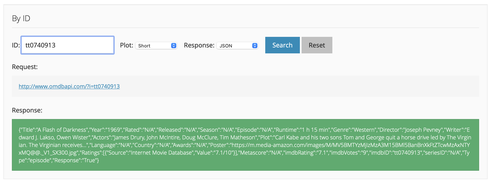
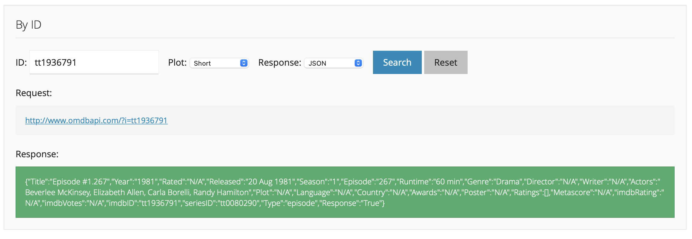

# OMDB Bug?

## Found Episode

The Virginian - S02E11 - Fatal Journey
([imdb](https://www.imdb.com/title/tt0741070/))
([tvdb](https://thetvdb.com/series/the-virginian/episodes/14262))
([tmdb](https://www.themoviedb.org/tv/10180-the-virginian/season/2/episode/11))
([trakt](https://trakt.tv/shows/the-virginian/seasons/2/episodes/11))

omdb api response

The response contains `seriesID`, `Season`, and `Episode` properly populated.



```json
{
    "Title": "The Fatal Journey",
    "Year": "1963",
    "Rated": "TV-PG",
    "Released": "04 Dec 1963",
    "Season": "2",
    "Episode": "11",
    "Runtime": "75 min",
    "Genre": "Western",
    "Director": "Bernard McEveety",
    "Writer": "John Hawkins, Charles Marquis Warren, Owen Wister",
    "Actors": "Lee J. Cobb, Doug McClure, Gary Clarke",
    "Plot": "The Virginian plans to propose to Molly but four men ride into Medicine Bow emptying their pistols into the newspaper office killing her. Although the posse is forced to turn back, The Virginian continues on for revenge but is captur",
    "Language": "English",
    "Country": "United States",
    "Awards": "N/A",
    "Poster": "https://m.media-amazon.com/images/M/MV5BMjZmOTU4ZmYtMmU0NS00MDU3LTg4ZmItNTdjODg4ZTFjYWYxXkEyXkFqcGdeQXVyNTM3MDMyMDQ@._V1_SX300.jpg",
    "Ratings": [
        {
            "Source": "Internet Movie Database",
            "Value": "8.3/10"
        }
    ],
    "Metascore": "N/A",
    "imdbRating": "8.3",
    "imdbVotes": "63",
    "imdbID": "tt0741070",
    "seriesID": "tt0055710",
    "Type": "episode",
    "Response": "True"
}
```

## Missing Episode 1

The Virginian - S08E02 - A Flash of Darkness
([imdb](https://www.imdb.com/title/tt0740913/))
([tvdb](https://thetvdb.com/series/the-virginian/episodes/14424))
([tmdb](https://www.themoviedb.org/tv/10180-the-virginian/season/8/episode/2))
([trakt](https://trakt.tv/shows/the-virginian/seasons/8/episodes/2))

omdb api response

The response contains `seriesID`, `Season`, and `Episode` but they're all set to `N/A`.



```json
{
    "Title": "A Flash of Darkness",
    "Year": "1969",
    "Rated": "N/A",
    "Released": "N/A",
    "Season": "N/A",
    "Episode": "N/A",
    "Runtime": "1 h 15 min",
    "Genre": "Western",
    "Director": "Joseph Pevney",
    "Writer": "Edward J. Lakso, Owen Wister",
    "Actors": "James Drury, John McIntire, Doug McClure, Tim Matheson",
    "Plot": "Carl Kabe and his two sons Tom and George quit a horse drive led by The Virginian. The Virginian receives...",
    "Language": "N/A",
    "Country": "N/A",
    "Awards": "N/A",
    "Poster": "https://m.media-amazon.com/images/M/MV5BMTYzMjIzMzA3M15BMl5BanBnXkFtZTcwMzAxNTYxMQ@@._V1_SX300.jpg",
    "Ratings": [
        {
            "Source": "Internet Movie Database",
            "Value": "7.1/10"
        }
    ],
    "Metascore": "N/A",
    "imdbRating": "7.1",
    "imdbVotes": "9",
    "imdbID": "tt0740913",
    "seriesID": "N/A",
    "Type": "episode",
    "Response": "True"
}
```

## Missing Episode 2

Texas - S1E267 - Episode #1.267
([imdb](https://www.imdb.com/title/tt1936791/))
([tvdb - show missing](https://thetvdb.com/search?menu%5Btype%5D=series&query=texas))
([tmdb - episode missing](https://www.themoviedb.org/tv/3150-texas/season/1))
([trakt - show missing](https://trakt.tv/search/shows/?query=texas&years=1979-1983))

omdb api response

The response contains `seriesID`, `Season`, and `Episode` properly populated, in spite of the amount of information missing in the various databases.



```json
{
    "Title": "Episode #1.267",
    "Year": "1981",
    "Rated": "N/A",
    "Released": "20 Aug 1981",
    "Season": "1",
    "Episode": "267",
    "Runtime": "60 min",
    "Genre": "Drama",
    "Director": "N/A",
    "Writer": "N/A",
    "Actors": "Beverlee McKinsey, Elizabeth Allen, Carla Borelli, Randy Hamilton",
    "Plot": "N/A",
    "Language": "N/A",
    "Country": "N/A",
    "Awards": "N/A",
    "Poster": "N/A",
    "Ratings": [],
    "Metascore": "N/A",
    "imdbRating": "N/A",
    "imdbVotes": "N/A",
    "imdbID": "tt1936791",
    "seriesID": "tt0080290",
    "Type": "episode",
    "Response": "True"
}
```
